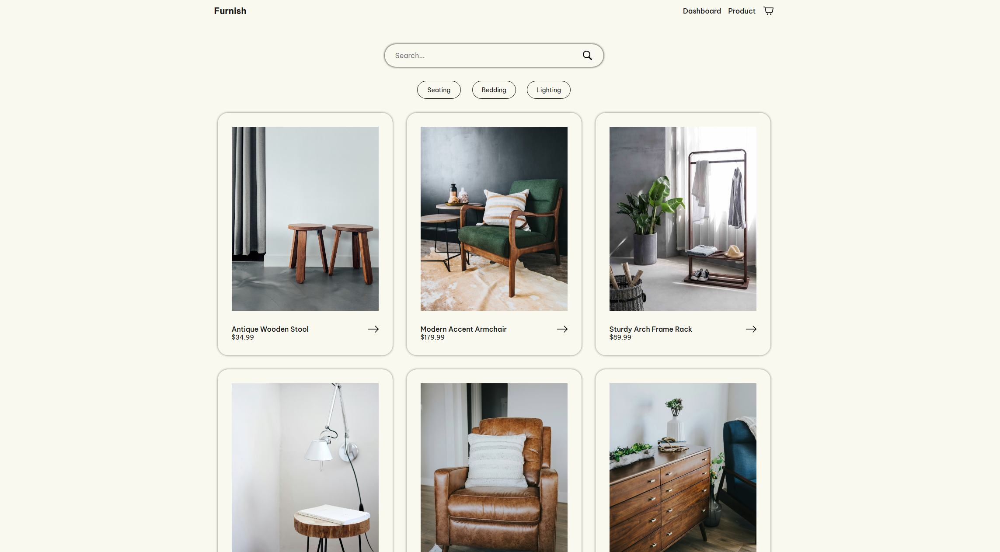

<h1 align="center">Furnish</h1>

    

<h2 align="left">About</h2>

Furnish is an e-commerce web application built with React, designed to provide a seamless shopping experience with product search, filtering, and a dynamic selection system.

<h2 align="left">Technologies Used</h2>

  
  
  
  
  
  
  
  

